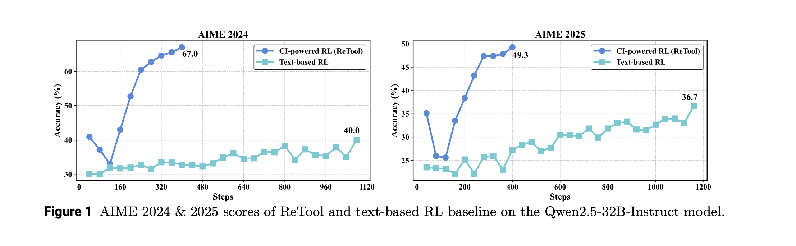

# ReTool: Reinforcement Learning for Strategic Tool Use in LLMs

A PyTorch implementation of **ReTool** from the paper ["ReTool: Reinforcement Learning for Strategic Tool Use in LLMs"](https://arxiv.org/abs/2504.11536) by Feng et al. (2025).

ReTool enhances long-form reasoning by integrating code interpreter execution into the RL training loop, enabling models to learn when and how to invoke computational tools for mathematical problem solving.

<div align="center">
  
  <p><em>Figure 2: Comparison of standard text-based RL vs ReTool's code-integrated training process</em></p>
</div>

## 🚀 Key Features

- **Multi-turn Generation**: Dynamic code execution during reasoning with KV-cache optimization
- **Strategic Tool Use**: Learns when and how to invoke code interpreters through RL
- **Interpreter Masking**: Excludes external tool outputs from gradient computation
- **Production Ready**: Built on HuggingFace Transformers with proper batching and distributed training support


## 📊 Performance

<div align="center">
  
  <p><em>Figure 1: ReTool achieves 67% accuracy on AIME 2024, significantly outperforming text-based RL (40%)</em></p>
</div>

## 🛠️ Installation

```bash
git clone https://github.com/yourusername/retool-implementation.git
cd  retool-implementation/scr
pip install -r requirements.txt
```

## 🚧 Current Status

**This is a research implementation based on the ReTool paper.** The core components are implemented but not yet fully tested. 

### What's Implemented ✅
- Multi-turn generation with KV-cache optimization
- Interpreter token masking for RL training
- Modified PPO loss computation
- Complete training pipeline structure
- Proper tensor handling and batching

### What Needs Testing/Integration 🔧
- End-to-end training verification
- Code execution sandbox integration  
- Edge case handling for truncated sequences
- Memory optimization for large models

### For Researchers & Developers

This implementation serves as a foundation for:
- Understanding ReTool's architecture
- Building upon the multi-turn generation approach
- Integrating custom code execution environments
- Extending to other tool-use scenarios

## 📊 Dataset Format

Your dataset should contain dictionaries with:

```python
{
    "prompt": "Solve this math problem: ...",
    "answer": "42"  # Ground truth for reward computation
}
```

## 🔍 How It Works

1. **Multi-turn Generation**: Model generates reasoning step-by-step
2. **Code Detection**: When `</code>` is generated, extract and execute code
3. **Tool Integration**: Append `<interpreter>result</interpreter>` to context
4. **Continued Reasoning**: Model continues with tool feedback
5. **Reward Computation**: Binary reward based on final answer correctness
6. **RL Training**: PPO updates exclude interpreter tokens from loss

## ⚙️ Key Components

### ReToolTrainer Class

- `_retool_generate_with_interpreter()`: Multi-turn generation with tool execution
- `_create_interpreter_mask()`: Creates masks for excluding tool outputs
- `_compute_loss()`: Modified PPO loss with interpreter masking
- `_compute_rewards_and_advantages()`: Binary reward computation

### Configuration Options

```python
trainer = ReToolTrainer(
    # ... model and data ...
    max_turns=10,              # Maximum reasoning turns
    temperature=0.7,           # Generation temperature
    max_completion_length=1024, # Max tokens per turn
    mask_truncated_completions=True,  # Handle incomplete sequences
)
```

## 💡 Usage Example (Conceptual)

```python
from retool_trainer import ReToolTrainer
from transformers import AutoModelForCausalLM, AutoTokenizer, TrainingArguments

# This shows the intended API - full testing in progress
trainer = ReToolTrainer(
    model=AutoModelForCausalLM.from_pretrained("Qwen/Qwen2.5-32B-Instruct"),
    processing_class=AutoTokenizer.from_pretrained("Qwen/Qwen2.5-32B-Instruct"),
    args=TrainingArguments(...),
    train_dataset=your_math_dataset,
    max_turns=10,
)

# trainer.train()  # Full integration testing in progress
```

## 📈 Results From Paper

- **AIME 2024**: 67% accuracy (vs 40% text-based RL)
- **AIME 2025**: 49.3% accuracy (vs 36.7% text-based RL)
- **Efficiency**: Converges in 400 steps vs 1080 for baseline
- **Token Efficiency**: 40% reduction in response length

## 🚧 Limitations & TODOs

- [ ] Code execution sandbox integration
- [ ] Support for multiple reward functions
- [ ] Advanced error handling for malformed code
- [ ] Distributed training optimizations
- [ ] Tool selection beyond code interpreter
- [ ] [June 2, 2025 update] Add DAPO trainer


## 📚 Citation

```bibtex
@article{feng2025retool,
  title={ReTool: Reinforcement Learning for Strategic Tool Use in LLMs},
  author={Feng, Jiazhan and Huang, Shijue and Qu, Xingwei and Zhang, Ge and Qin, Yujia and Zhong, Baoquan and Jiang, Chengquan and Chi, Jinxin and Zhong, Wanjun},
  journal={arXiv preprint arXiv:2504.11536},
  year={2025}
}
```

## 📄 License

MIT License - see [LICENSE](LICENSE) file for details.

**🤝 Collaboration welcome:**
Looking for teammates with complementary skills:
- **Systems engineers**: Distributed sandbox architecture with load balancing
- **Compute sponsors**: Academic institutions or cloud providers for training runs
- **Experimenters**: End-to-end validation and benchmarking on mathematical reasoning tasks


## 🙏 Acknowledgments

- Original paper authors for the ReTool framework
- HuggingFace team for the transformers library
- TRL team for GRPO implementation patterns

---

<div align="center">
  <strong>Built with ❤️ for advancing AI reasoning capabilities</strong>
</div>


